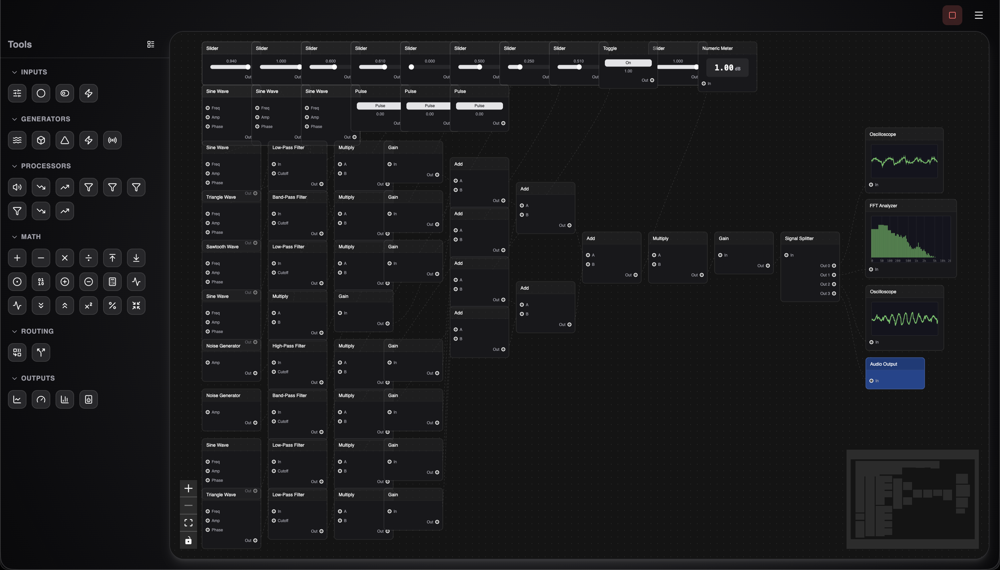

# Signals

A visual signal processing and waveform generation application built with React and the Web Audio API.



## Overview

Signals allows users to visually build signal processing chains using a node-based interface with real signal data flowing through the system. It's capable of producing actual usable signals for audio production.

### Features

- **Visual Node Editor**: Drag-and-drop interface for building signal processing chains
- **Real-time Audio**: Powered by the Web Audio API for actual signal generation and processing
- **Live Waveform Visualization**: Oscilloscope blocks display real-time waveforms
- **Persistent State**: Projects are automatically saved and restored across sessions

## Block Types

### Generators
- Sine Wave
- Square Wave
- Triangle Wave
- Sawtooth Wave
- Noise

### Processors
- Gain
- Low-pass Filter
- High-pass Filter
- Band-pass Filter

### Routing
- Multiplexer (2/4/8 inputs)
- Splitter (2/4/8 outputs)

### Outputs
- Oscilloscope (real-time waveform display)
- Audio Output

## Getting Started

### Prerequisites

- [Bun](https://bun.sh/) runtime

### Installation

```bash
bun install
```

### Development

```bash
bun run dev
```

The application will be available at http://localhost:5173

### Build

```bash
bun run build
```

### Preview Production Build

```bash
bun run preview
```

## Usage

1. **Add Blocks**: Drag blocks from the left toolbar onto the canvas
2. **Connect Blocks**: Click and drag from an output port to an input port to create connections
3. **Configure Blocks**: Click on a block to open the configuration drawer on the right
4. **Start Playback**: Click the play button to start signal processing
5. **Visualize**: Connect an oscilloscope to see real-time waveforms

### Connection Rules

- Input ports accept only one incoming connection (new connections replace existing ones)
- Output ports can connect to multiple inputs (up to 8)
- Connections animate when playback is active

## Tech Stack

- [React](https://react.dev/) - UI framework
- [ReactFlow](https://reactflow.dev/) - Node-based editor
- [Web Audio API](https://developer.mozilla.org/en-US/docs/Web/API/Web_Audio_API) - Audio processing
- [Zustand](https://zustand-demo.pmnd.rs/) - State management
- [Vite](https://vitejs.dev/) - Build tool
- [Tailwind CSS](https://tailwindcss.com/) - Styling

## License

MIT
